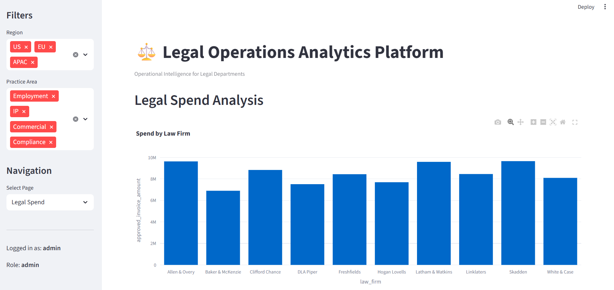
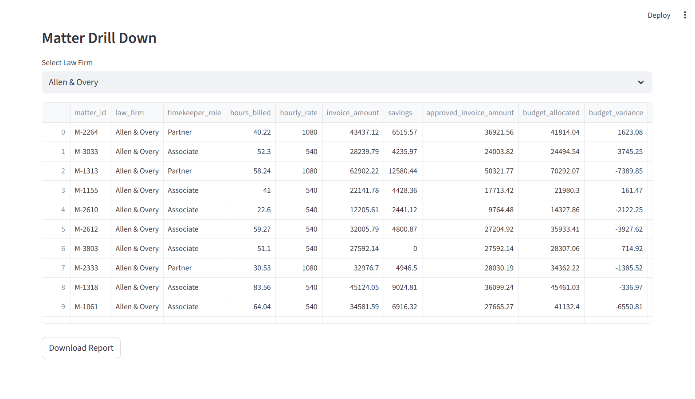
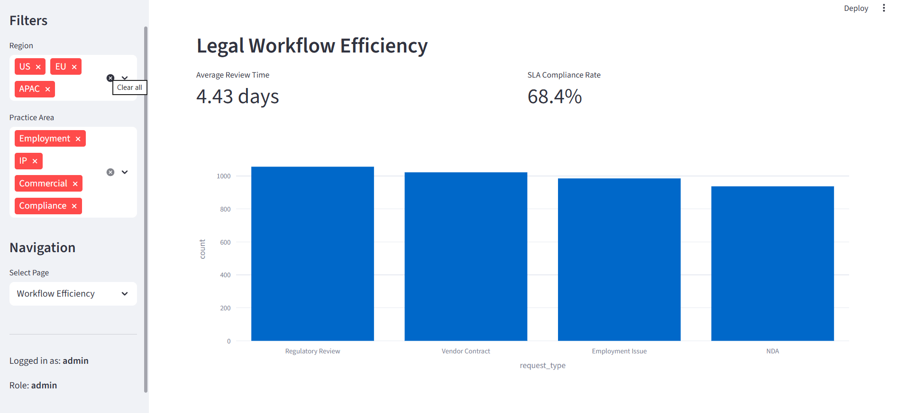
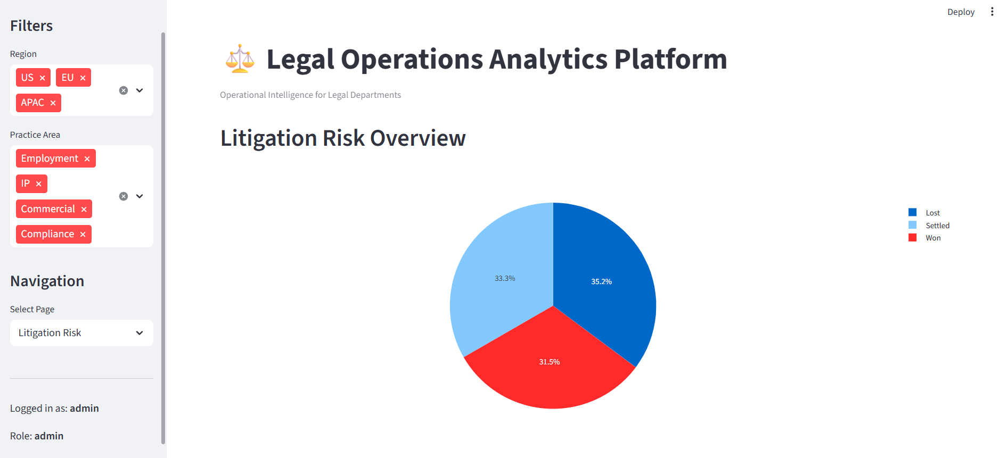

# Legal Operations Analytics Platform

## Live Demo

🔗 **Open the dashboard here:**  
https://tbinitial-cyber-legal-ops-analytics-app-app-tcmrua.streamlit.app/

A Python-based analytics application designed to simulate how corporate legal departments monitor legal spend, workflow efficiency, and litigation risk.

The application provides operational insights using a synthetic legal dataset and demonstrates how Legal Operations teams can leverage analytics to improve decision-making.

---

## Overview

Legal departments often struggle to track:

- Legal spend across outside counsel
- Efficiency of legal request workflows
- Litigation risk exposure
- Savings generated through invoice review

This project builds a lightweight analytics platform that provides visibility into those metrics.

---

## Dashboard Preview

### Legal Department Overview


---

### Legal Spend Analysis – Chart



---

### Legal Spend Analysis – Matter Drill Down



---

### Workflow Efficiency Metrics



---

### Litigation Risk Overview



---

## Features

- User authentication system
- Role-based access control (RBAC)
- Legal spend analytics
- Workflow efficiency monitoring
- Litigation risk dashboard
- Global filters for region and practice area
- Drill-down analysis by law firm
- Exportable reports
- Audit logging of user activity
- AI-style insight panel summarizing operational metrics

---

## Tech Stack

Python  
Streamlit  
Pandas  
Plotly  

---

## Project Structure

```
legal_ops_project
│
├── app.py
├── auth.py
├── users.json
├── dataset_generator.py
├── requirements.txt
├── README.md
│
├── screenshots
│   ├ overview_dashboard.png
│   ├ legal_spend_chart.png
│   ├ legal_spend_table.png
│   ├ workflow_metrics.png
│   └ litigation_risk_overview.png
│
├── data
│   ├ matter_master_dataset.csv
│   ├ legal_spend_dataset.csv
│   ├ legal_workflow_dataset.csv
│   └ litigation_dataset.csv
│
└── logs
```

---

## Running the Application

### 1. Install dependencies

```
pip install -r requirements.txt
```

### 2. Generate the synthetic datasets

```
python dataset_generator.py
```

### 3. Launch the dashboard

```
streamlit run app.py
```

The application will open automatically in your browser.

---

## Demo Accounts

| Role | Username | Password |
|-----|----------|---------|
| Admin | admin | admin123 |
| Legal Ops | analyst | analyst123 |
| Viewer | viewer | viewer123 |

Admin users can access the litigation dashboard, while other users have limited access.

---

## Example Insights

The dashboard can highlight insights such as:

- Top law firms driving legal spend
- SLA compliance in legal request workflows
- Cost savings generated by invoice review
- Distribution of litigation outcomes
- Regional trends in legal matters

---

## Use Case

This project demonstrates how legal departments could build internal analytics tools to monitor operational performance and manage outside counsel spend.

---

## Future Improvements

- Integration with a database instead of CSV files
- Automated anomaly detection for legal spend
- Advanced causal analysis of legal workflow efficiency
- Natural language query interface for legal analytics

---

## Author

Tarun Bhatia